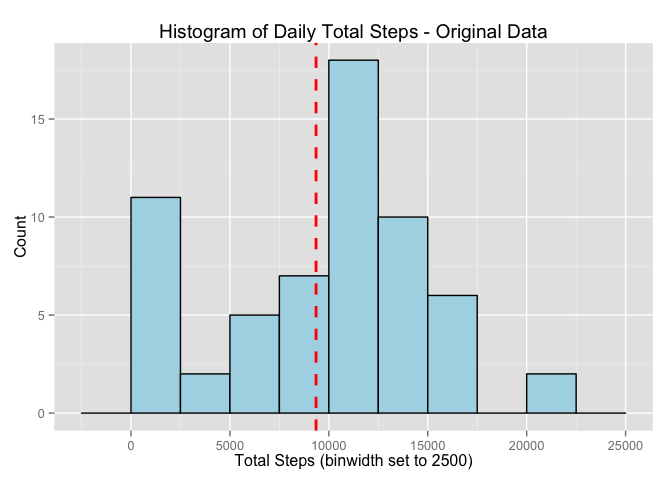

# Reproducible Research: Peer Assessment 1
Kirsten Smith  


## Loading required packages

```r
library(knitr)
library(ggplot2)
```


## Loading and preprocessing the data
Please note that the script expects a file called "activity.zip" in the same directory as the script itself.

```r
unzip("activity.zip")
data <- read.csv("activity.csv")
data$date <- as.POSIXct(data$date, format = "%Y-%m-%d")
```
Sample of 10 rows from the data set:

```r
kable(data[2303:2312,],align='c')
```

        steps       date       interval 
-----  -------  ------------  ----------
2303     NA      2012-10-08      2350   
2304     NA      2012-10-08      2355   
2305      0      2012-10-09       0     
2306      0      2012-10-09       5     
2307      0      2012-10-09       10    
2308      0      2012-10-09       15    
2309      0      2012-10-09       20    
2310     13      2012-10-09       25    
2311     28      2012-10-09       30    
2312      0      2012-10-09       35    

## What is mean total number of steps taken per day?
Creating a version of the data aggregated by day:


```r
daily_total <- aggregate(x=data$steps, by=list(data$date), sum, na.rm=TRUE)
colnames(daily_total) <- c("date","total.steps")
daily_total$month <- months(daily_total$date)
```

Taking a look at the daily totals:

```r
ggplot(daily_total, aes(x=format(date, "%d"),y=total.steps, fill=weekdays(date))) + geom_bar(stat="identity") + ylab("Total Number of Steps") + xlab("Day of the Month") + ggtitle("Total Steps Taken Each Day") + facet_grid(month ~ .) + scale_fill_discrete("Day of the Week")
```

 

As per assignment, putting together a histogram of the number of steps each day:

```r
ggplot(daily_total, aes(x=total.steps)) + geom_histogram(binwidth = 2500, colour="black", fill="light blue") + ggtitle("Histogram of Daily Total Steps") + ylab("Count") + xlab("Total Steps (binwidth set to 2500)") + geom_vline(aes(xintercept=mean(total.steps, na.rm=TRUE)), color="red", linetype="dashed", size=1)
```

 

The overall daily average is:

```r
mean(daily_total$total.steps, na.rm=TRUE)
```

```
## [1] 9354.23
```

The overall daily median is:

```r
median(daily_total$total.steps, na.rm=TRUE)
```

```
## [1] 10395
```

## What is the average daily activity pattern?
Aggregate the data by interval means instead of daily total:

```r
interval_means <- aggregate(x=data$steps, by=list(data$interval), mean, na.rm=TRUE)
colnames(interval_means) <- c("interval","avg.steps")
```

Plot the average time series data for a day:

```r
ggplot(interval_means, aes(x=interval,y=avg.steps)) + geom_line(color="dark green")
```

 

Highest average number of steps is at:

```r
step_max <- interval_means[interval_means$avg.steps == max(interval_means$avg.steps),]
kable(step_max,row.names = FALSE)
```


 interval   avg.steps
---------  ----------
      835    206.1698

## Imputing missing values
Total number of rows with missing values is:

```r
sum(is.na(data$steps))
```

```
## [1] 2304
```

We will now supplement the missing values with the average number of steps for that interval (found in the average daily activity pattern) by iterating through all rows of the data set:

```r
supplemented <- data
for(i in 1:nrow(supplemented)) {
    if(is.na(supplemented$steps[i])) {
        supplemented$steps[i] <-         interval_means[which(interval_means$interval==supplemented$interval[i]),]$avg.steps
        }
    }

kable(supplemented[2303:2312,], align='c', row.names = TRUE)
```

          steps          date       interval 
-----  ------------  ------------  ----------
2303    0.2264151     2012-10-08      2350   
2304    1.0754717     2012-10-08      2355   
2305    0.0000000     2012-10-09       0     
2306    0.0000000     2012-10-09       5     
2307    0.0000000     2012-10-09       10    
2308    0.0000000     2012-10-09       15    
2309    0.0000000     2012-10-09       20    
2310    13.0000000    2012-10-09       25    
2311    28.0000000    2012-10-09       30    
2312    0.0000000     2012-10-09       35    

## Are there differences in activity patterns between weekdays and weekends?
